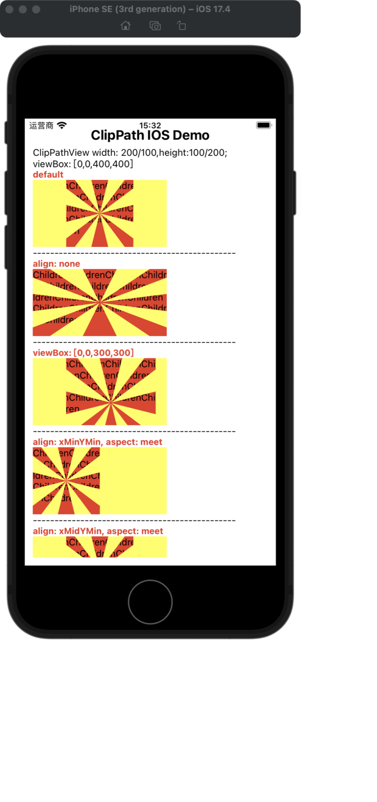
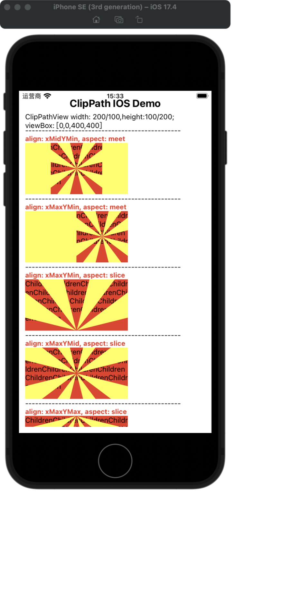
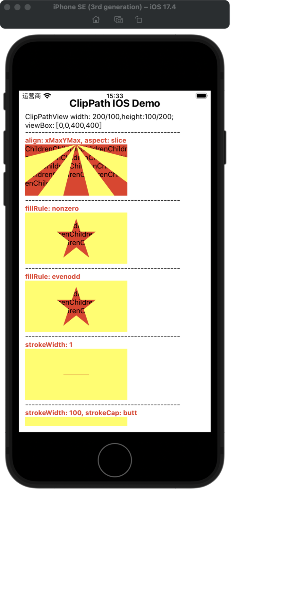
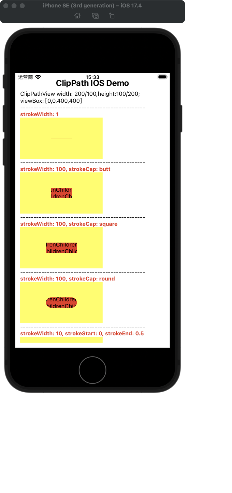
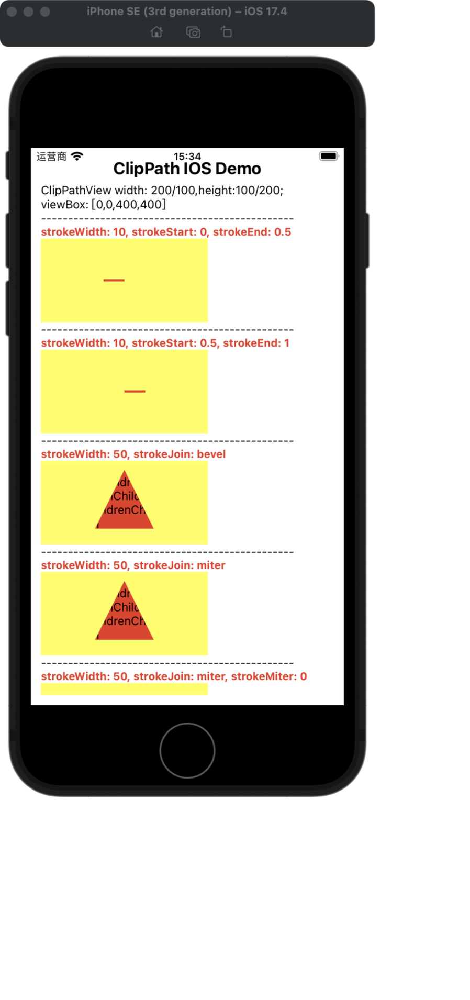
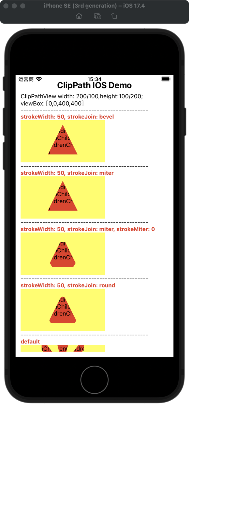
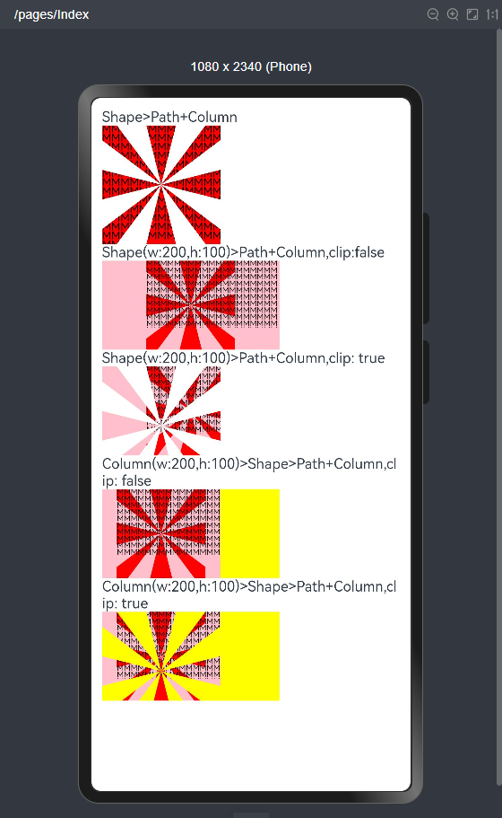

---
html:
  embed_local_images: true
  embed_svg: true
  offline: false
  toc: undefined
print_background: false
---

## Clip Path ArcTS 实现问题

#### 说明表
| 属性                 | 描述                                                                                                      | 类型              | 默认值      | 鸿蒙属性                                |
|----------------------|---------------------------------------------------------------------------------------------------------|-------------------|-------------|-----------------------------------------|
| svgKey               | 唯一key                                                                                                   | string            | -           | Shape().key()                           |
| d                    | 形状由一系列命令定义（svg path data）                                                                       | string            | -           | Path({ commands: d })                   |
| viewBox              | 定义用户空间中的位置和维度                                                                                | Array<Number>(4)  | [0,0,-1,-1] | Shape().viewPort()                      |
| align                | preserveAspectRatio 属性的 align                                                                          | string            | xMidYMid    | 无                                      |
| aspect               | preserveAspectRatio 属性的 meetOrSlice                                                                    | meet/slice/none   | meet        | 无                                      |
| fillRule             | 路径内部填充规则                                                                                          | nonzero/evenodd   | nonzero     | 无                                      |
| strokeWidth          | 路径描边宽度                                                                                              | number            | 1           | Shape().strokeWidth()                   |
| strokeCap            | 开放路径两端的形状                                                                                        | butt/round/square | butt        | Shape().strokeLineCap()                 |
| strokeJoin           | 路径转角处使用的形状                                                                                      | bevel/miter/round | miter       | Shape().strokeLineJoin()                |
| strokeMiter          | strokeJoin值是miter，设置夹角延伸                                                                          | number            | 4           | Shape().strokeMiterLimit()              |
| strokeStart          | IOS CAShapeLayer 描线开始的地方占总路径的百分比。默认值是0。                                                | number            | 0           | 无                                      |
| strokeEnd            | IOS CAShapeLayer 表示绘制结束的地方站总路径的百分比。默认值是1，如果小于等于strokeStart 则绘制不出任何内容。 | number            | 1           | 无                                      |
| translateZ           | 设置定位层级，相当于index                                                                                  | number            | 0           | Shape().zIndex()                        |
| transX               | 在二维平面上水平方向移动元素                                                                              | number            | 0           | Shape().translate({ x: 0 })             |
| transY               | 在二维平面上垂直方向移动元素                                                                              | number            | 0           | Shape().translate({ y: 0 })             |
| transPercentageValue | transX、transY 使用百分比                                                                                  | boolean           | false       | 无                                      |
| rot                  | 元素围绕一个定点旋转                                                                                      | number            | 0,0(左上角) | Shape().rotate({ angle: 0})             |
| rotOx                | 旋转中心点水平位置                                                                                        | number            | 0           | Shape().rotate({ centerX: 0})           |
| rotOy                | 旋转中心点垂直位置                                                                                        | number            | 0           | Shape().rotate({ centerY: 0})           |
| rotPercentageValue   | rotOx、rotOy 使用百分比                                                                                    | boolean           | false       | 无                                      |
| sc                   | 放大或缩小元素                                                                                            | number            | 1           | Shape().scale({x: 1, y: 1 })            |
| scX                  | 水平缩放                                                                                                  | number            | 1           | Shape().scale({x: 1})                   |
| scY                  | 垂直缩放                                                                                                  | number            | 1           | Shape().scale({y: 1})                   |
| scO                  | 缩放中心点位置                                                                                            | number            | 0,0(左上角)        | Shape().scale({centerX: 0, centerY: 0}) |
| scOx                 | 缩放中心点水平位置                                                                                        | number            | 0           | Shape().scale({centerX: 0})             |
| scOy                 | 缩放中心点垂直位置                                                                                        | number            | 0           | Shape().scale({centerY: 0})             |
| scPercentageValue    | scO、scOx、scOy使用百分比                                                                                   | boolean           | false       | 无                                      |


#### 无法实现说明
> 源库 `align` `aspect` `fillRule` `strokeStart` `strokeEnd` 目前无法在鸿蒙实现

- 源库 `align` `aspect` 对应的是 SVG preserveAspectRatio 属性，目前Shape、Path不支持
    - 该属性解决 viewBox 和 svg 宽高比不一致，图像展示（填充）问题
    - preserveAspectRatio: none 图像会根据svg的宽高填满整个区域
    - ArcUI Path 的绘制是根据路径 commonds 占据的像素来绘制，不会根据 Shape 宽高填满整个区域

- 源库 `fillRule` 设置路径相交后，填充规则，目前Shape、Path不支持

- 源库 `strokeStart` `strokeEnd` 是 IOS ([说明](https://cloud.tencent.com/developer/article/1153195))设置描边区域，目前Shape、Path不支持，描边可以使用 strokeWidth 设置

- `strokeCap` `strokeJoin` `strokeMiter` 这个3个属性与clip 有冲突
    - 这三个属性是设置路径描边相交的方式，由于使用了 clip 裁切，边框在外部展示部分会被裁切，因此无法看到。

## IOS `align` `aspect` `fillRule` `strokeStart` `strokeEnd` 效果








## ArcTS clip 对不齐
ArcUI Shape、Path 绘制时的问题
- 默认按照 viewPort 中定义的 width height 绘制
- Path 设置宽高没有效果
- Shape 设置宽高如果与 viewPort 不是同一比例时，绘制的图形居中显示且无法设置其它对齐方式，只能居中；Path 会等比缩放适应外层盒子宽高比
- Shape 设置 clip 属性后，Shape 不设置宽高，绘制图形和裁切路径是对齐的
- Shape 设置 clip 属性后，Shape 设置宽高并且比例与 viewBox 绘制路径宽高比不一致，绘制图形和裁切路径没有对齐
```js
build() {
    Column() {
      Text('Shape>Path+Column')
      Shape() {
        Path({
          commands: path
        })
        Column() {
          Text('MMMMMMMMMMMMMMMMMMMMMMMMMMMMMMMMMMMMMMMMMMMMMMMMMMMMMMMMMMMMMMMMMMMMMMMMMMMMMMMMMMMMMMMMMMMMMMMMMMMMMMMMMMMMMMMMMMMMMMMMMMMMMMMMMMMMMMMMMMMMMMMMMMMMMMMMMMMMMMMMMMMMMMMMMMMMMMMMMMMMMMMMMMMMMMMMMMMMMMMMMMMMMMMMMMMMMMMMMMMMMMMMMMMMMMMMMMMMMMMMMMMMMMMMMMMMMMMMMMMMMMMMMMMMMMMMMMMMMMMMMMMMMMMMMMMMMMMMMMMMMMMMMMMMMMMMMMMMMMMMMMMMMMMMMMMMMMMMMMMMMMMMMMMMMMMMMMMMMMMMMMMMMMMMMMMMMMMMMMMMMMMMMMMMMMMMMMMMMMMMMMMMMMMMMMMMMMMMMMMM')
            .fontColor(Color.Black).fontSize(12).lineHeight(10)
        }
      }
      .clip(new Path({ commands: path }))
      .viewPort({
        x: 0,
        y: 0,
        width: '400px',
        height: '400px'
      })
      .fill(Color.Red)
      .backgroundColor(Color.Pink)
      .strokeWidth(0)

      Text('Shape(w:200,h:100)>Path+Column,clip:false')
      Shape() {
        Path({
          commands: path
        })
        Column() {
          Text('MMMMMMMMMMMMMMMMMMMMMMMMMMMMMMMMMMMMMMMMMMMMMMMMMMMMMMMMMMMMMMMMMMMMMMMMMMMMMMMMMMMMMMMMMMMMMMMMMMMMMMMMMMMMMMMMMMMMMMMMMMMMMMMMMMMMMMMMMMMMMMMMMMMMMMMMMMMMMMMMMMMMMMMMMMMMMMMMMMMMMMMMMMMMMMMMMMMMMMMMMMMMMMMMMMMMMMMMMMMMMMMMMMMMMMMMMMMMMMMMMMMMMMMMMMMMMMMMMMMMMMMMMMMMMMMMMMMMMMMMMMMMMMMMMMMMMMMMMMMMMMMMMMMMMMMMMMMMMMMMMMMMMMMMMMMMMMMMMMMMMMMMMMMMMMMMMMMMMMMMMMMMMMMMMMMMMMMMMMMMMMMMMMMMMMMMMMMMMMMMMMMMMMMMMMMMMMMMMMMM')
            .fontColor(Color.Black).fontSize(12).lineHeight(10)
        }
      }
      // .clip(new Path({ commands: path }))
      .viewPort({
        x: 0,
        y: 0,
        width: '400px',
        height: '400px'
      })
      .fill(Color.Red)
      .backgroundColor(Color.Pink)
      .strokeWidth(0)
      .width(200)
      .height(100)

      Text('Shape(w:200,h:100)>Path+Column,clip: true')
      Shape() {
        Path({
          commands: path
        })
        Column() {
          Text('MMMMMMMMMMMMMMMMMMMMMMMMMMMMMMMMMMMMMMMMMMMMMMMMMMMMMMMMMMMMMMMMMMMMMMMMMMMMMMMMMMMMMMMMMMMMMMMMMMMMMMMMMMMMMMMMMMMMMMMMMMMMMMMMMMMMMMMMMMMMMMMMMMMMMMMMMMMMMMMMMMMMMMMMMMMMMMMMMMMMMMMMMMMMMMMMMMMMMMMMMMMMMMMMMMMMMMMMMMMMMMMMMMMMMMMMMMMMMMMMMMMMMMMMMMMMMMMMMMMMMMMMMMMMMMMMMMMMMMMMMMMMMMMMMMMMMMMMMMMMMMMMMMMMMMMMMMMMMMMMMMMMMMMMMMMMMMMMMMMMMMMMMMMMMMMMMMMMMMMMMMMMMMMMMMMMMMMMMMMMMMMMMMMMMMMMMMMMMMMMMMMMMMMMMMMMMMMMMMMM')
            .fontColor(Color.Black).fontSize(12).lineHeight(10)
        }
      }
      .clip(new Path({ commands: path }))
      .viewPort({
        x: 0,
        y: 0,
        width: '400px',
        height: '400px'
      })
      .fill(Color.Red)
      .backgroundColor(Color.Pink)
      .strokeWidth(0)
      .width(200)
      .height(100)

      Text('Column(w:200,h:100)>Shape>Path+Column,clip: false')
      Column() {
        Shape() {
          Path({
            commands: path
          })
          Column() {
            Text('MMMMMMMMMMMMMMMMMMMMMMMMMMMMMMMMMMMMMMMMMMMMMMMMMMMMMMMMMMMMMMMMMMMMMMMMMMMMMMMMMMMMMMMMMMMMMMMMMMMMMMMMMMMMMMMMMMMMMMMMMMMMMMMMMMMMMMMMMMMMMMMMMMMMMMMMMMMMMMMMMMMMMMMMMMMMMMMMMMMMMMMMMMMMMMMMMMMMMMMMMMMMMMMMMMMMMMMMMMMMMMMMMMMMMMMMMMMMMMMMMMMMMMMMMMMMMMMMMMMMMMMMMMMMMMMMMMMMMMMMMMMMMMMMMMMMMMMMMMMMMMMMMMMMMMMMMMMMMMMMMMMMMMMMMMMMMMMMMMMMMMMMMMMMMMMMMMMMMMMMMMMMMMMMMMMMMMMMMMMMMMMMMMMMMMMMMMMMMMMMMMMMMMMMMMMMMMMMMMMM')
              .fontColor(Color.Black).fontSize(12).lineHeight(10)
          }
        }
        // .clip(new Path({ commands: path }))
        .viewPort({
          x: 0,
          y: 0,
          width: '400px',
          height: '400px'
        })
        .fill(Color.Red)
        .backgroundColor(Color.Pink)
        .strokeWidth(0)
      }
      .backgroundColor(Color.Yellow)
      .width(200)
      .height(100)
      .alignItems(HorizontalAlign.Start)

      Text('Column(w:200,h:100)>Shape>Path+Column,clip: true')
      Column() {
        Shape() {
          Path({
            commands: path
          })
          Column() {
            Text('MMMMMMMMMMMMMMMMMMMMMMMMMMMMMMMMMMMMMMMMMMMMMMMMMMMMMMMMMMMMMMMMMMMMMMMMMMMMMMMMMMMMMMMMMMMMMMMMMMMMMMMMMMMMMMMMMMMMMMMMMMMMMMMMMMMMMMMMMMMMMMMMMMMMMMMMMMMMMMMMMMMMMMMMMMMMMMMMMMMMMMMMMMMMMMMMMMMMMMMMMMMMMMMMMMMMMMMMMMMMMMMMMMMMMMMMMMMMMMMMMMMMMMMMMMMMMMMMMMMMMMMMMMMMMMMMMMMMMMMMMMMMMMMMMMMMMMMMMMMMMMMMMMMMMMMMMMMMMMMMMMMMMMMMMMMMMMMMMMMMMMMMMMMMMMMMMMMMMMMMMMMMMMMMMMMMMMMMMMMMMMMMMMMMMMMMMMMMMMMMMMMMMMMMMMMMMMMMMMMM')
              .fontColor(Color.Black).fontSize(12).lineHeight(10)
          }
        }
        .clip(new Path({ commands: path }))
        .viewPort({
          x: 0,
          y: 0,
          width: '400px',
          height: '400px'
        })
        .fill(Color.Red)
        .backgroundColor(Color.Pink)
        .strokeWidth(0)
      }
      .backgroundColor(Color.Yellow)
      .width(200)
      .height(100)
      .alignItems(HorizontalAlign.Start)
    }
    .alignItems(HorizontalAlign.Start)
    .padding(12)
  }
```

<br>
<br>
<br>
<br>
<br>
<br>

## 源库属性实现
- svgKey?: string;✅
- d?: string;✅
- align?: string;❌
- aspect?: string;❌
- fillRule?: string;❌
- viewBox?: TViewBox;✅
- strokeWidth?: number;✅
- strokeCap?: LineCapStyle;✅
- strokeJoin?: LineJoinStyle;✅
- strokeMiter?: number;✅
- strokeStart?: number;❌
- strokeEnd?: number;❌
- translateZ?: number; ✅
- transX?: number;✅
- transY?: number;✅
- transPercentageValue?: boolean; ✅
- rot?: number;✅
- rotOx?: number;✅
- rotOy?: number;✅
- rotPercentageValue?: boolean;✅
- sc?: number;✅
- scX?: number;✅
- scY?: number;✅
- scO?: number;✅
- scOx?: number;✅
- scOy?: number;✅
- scPercentageValue?: boolean;✅